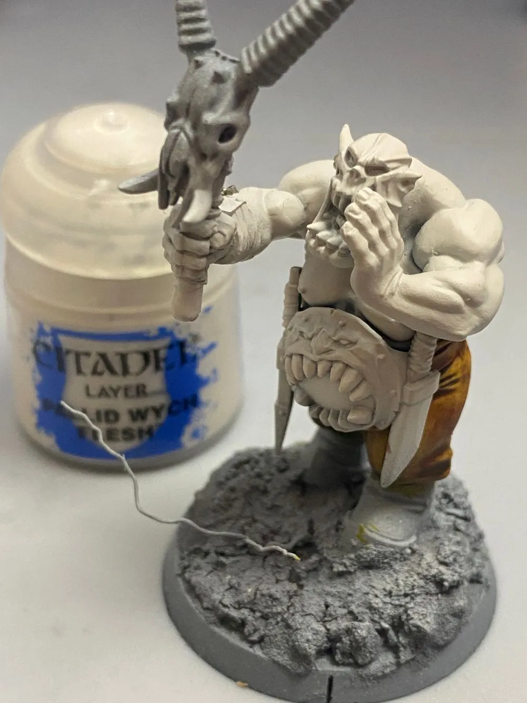
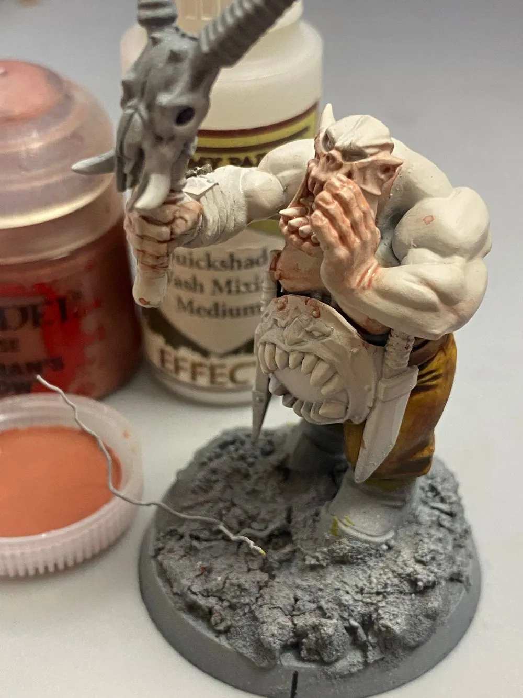
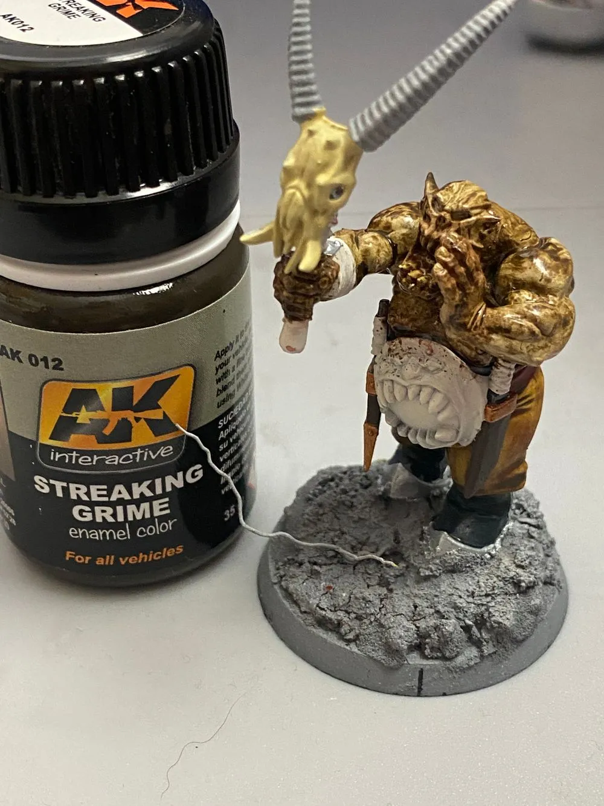
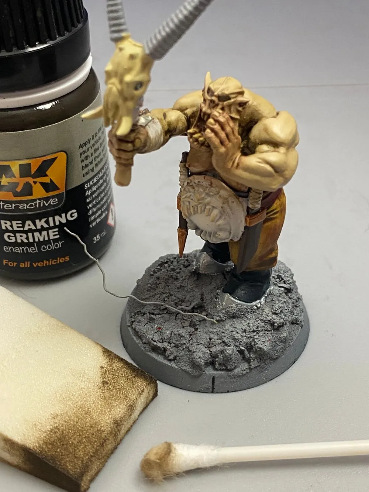
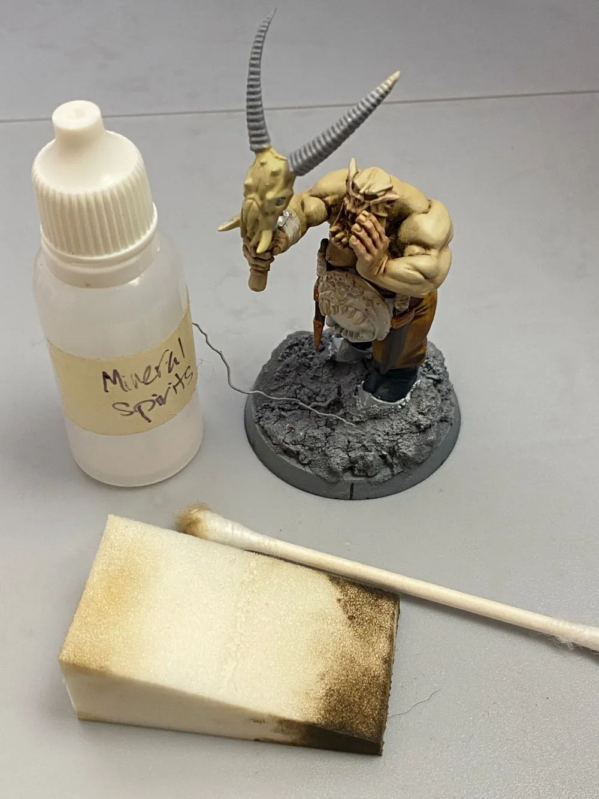
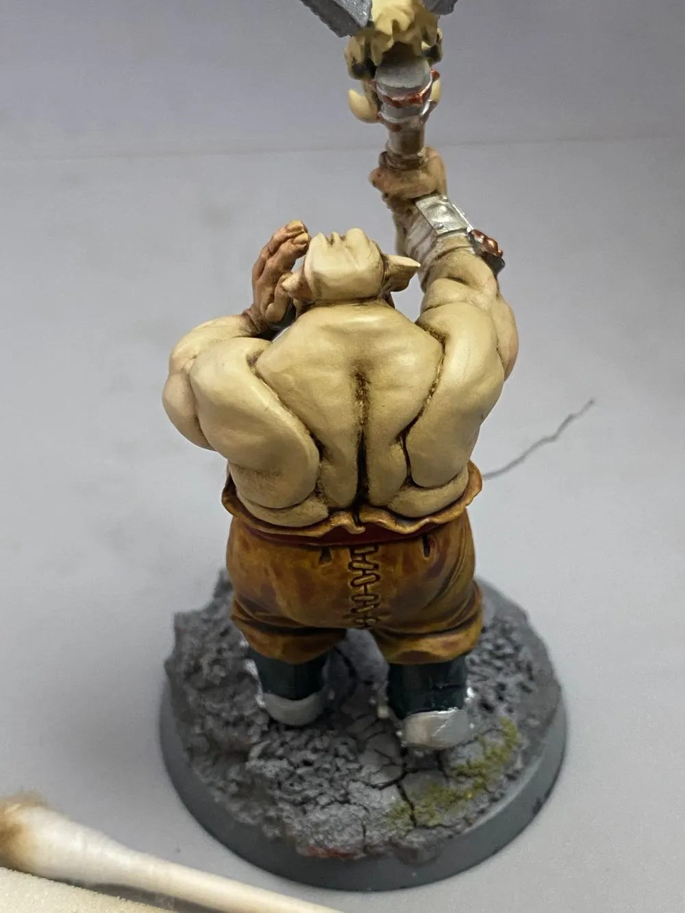
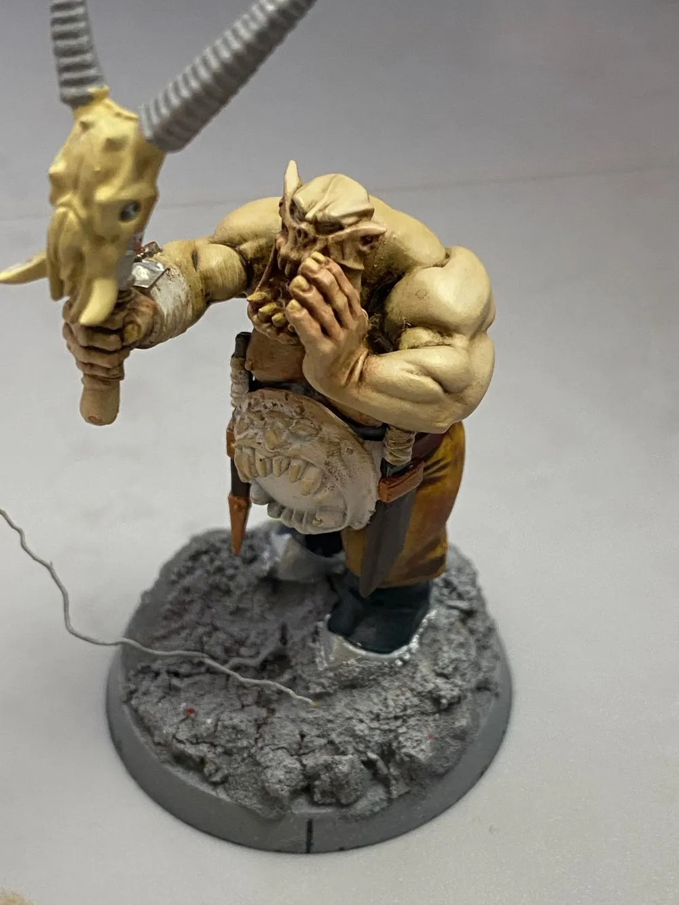
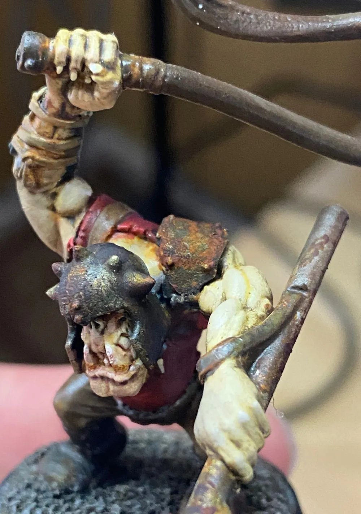
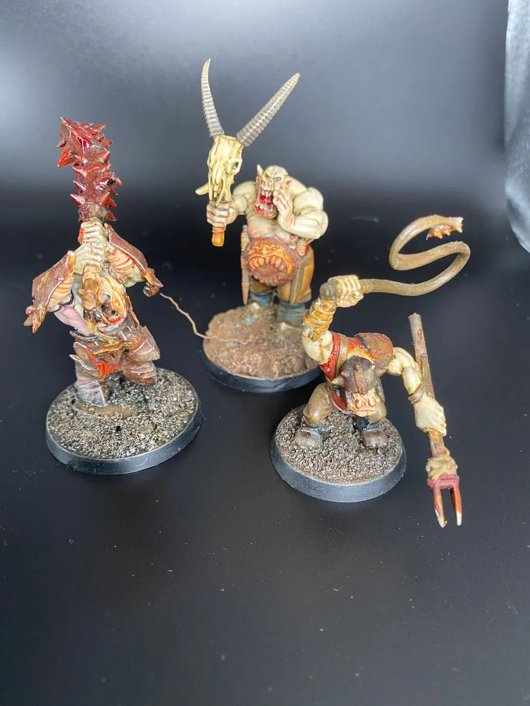

+++
title = "how to paint pale ork skin"
date = 2022-10-23
[taxonomies]
tags = ["ironjaws", "Orks", "age of sigmar", "miniature painting", "grimdark", "inq28"]
authors = ["Matt Gilbert"] 
+++

## intro
In honor of #orktober here is a guide on how to paint pale ork skin for that grimdark juice.

Here we go first actual painting tutorial on the website, this is for easy mode pale orc skin with as few steps as possible. I came up with this so I can use it to bust out my whole Ironjawz army.

## Step 1: Pallid Wych Flesh
I am starting with Grey primer and then lay down some pallid wych flesh:

## Step 2: Bugsman Glow Wash
I mix equal parters Bugmans glow with Army Painter Quickshade medium. I put this on the hands, face, elbows, and nips. After I took this photo, I realized I was kind of sloppy and went back and cleaned up some spatter.

## Step 3: Magic. Also called Streaking Grime
I smothered the model in an amazing product from AK interactive called streaking grime. I hit this with a heat gun to let it dry and then I used a make up sponge to wipe away most of it. This creates a really nice finish on the skin and provides a subtle green tint as well. For this first pass I just used the makeup sponge and q tip.

## Step 4: Refine with Mineral Spirits
I then added a small amount of mineral spirits on the sponge and selectively hit the highest parts of the model on the arms, hands and face. This creates a smooth transition as if you blended it the hard way.

## Step 5 (Final): Highlight with Menoth White
To finish this up, I use a glaze of Menoth White from P3, but this is totally optional. You could stop at step 4 if you are happy with the results. Here is the finished skin:

## Variations
If you want to have the same overall vibe but add in some varitaion to your orcs you can start with Rakarth Flesh, highlight with Palid Wytch Flesh, and then Menoth white, before you do the streaking grime process. That gives you something like this:

You can see there is a lot more variation in the skin tone and it comes out a little greener, but I did not think it was worth the time to do vs just blasting straight to palid wytch flesh for a ton of troops.

Heres a shot of the completed models, I am realizing I need to work on how to photograph miniatures:
