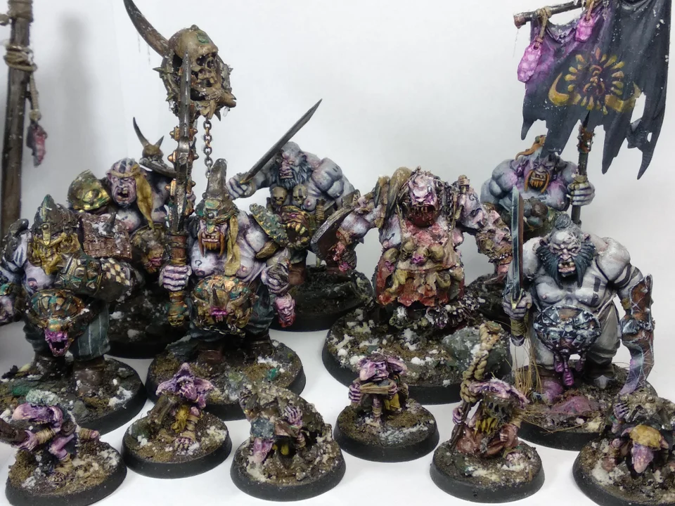

+++
title = "starting ogor"
date = 2022-10-23
[taxonomies]
tags = ["ogor mawtribes", "age of sigmar", "miniature painting"]
authors = ["Matt Gilbert"] 
+++

## intro

This time of year is always a time of fresh starts for me, and I can't resist any opportunity for a pun. Recently I have been smacked by the depth of my miniature painting backlog. Here is my shame:

I've made the decision to start downsizing this mess and even turn it into a fully built display shelf. My goal is turn each each into a diorama, and I also thinking if it would be possible to turn the dioramas into the rise sizes for a themed gaming table as well. I will update on that as it develops. I want to actually start playing games again, and I wanted a low model count army to jump back into AOS. I sat out all of 2.0 after going pretty hard in 1.0 with my Seraphon, and now I want to change it up with an army I have admired since the days of Warhammer Fantasy - Ogre Kingdoms - I mean Ogor Mawtribes TM.

I was inspired to finally paint these chonkers up when I heard that their 3.0 battletome will be released soon. I have been stashing and collecting every metal kit I have come across, and I want to keep to the original oldhammer line with these guys. This is really going to be a collection of love for me, as I plan on getting all of the old metal kits. Right now I really only have the Icebrow hunter, a butcher, and some gnoblar trackers in metal. For my army I plan on playing Beast Claw Raiders, and I have 3 start collecting boxes worth of them. I figured I should be able to hit a 2k list pretty fast with these boys. 

In terms of painting I have been deeply inspired by the work of reddit user SuspiciousNewspaper, I think they also go by [Ekkius][ekkius] on instagram. I saw their [original post][redditpost] over a year ago and took some notes on the process. Here is the original image I am going to riff on:

## painting guide
I've complied their comments from multiple posts to create a rough outline of how they did it:

### skin
- black undercoat priming + zenithal white undercoat.
- then apply to the skin vallejo model color pale grey blue.
- apply light washj 1:1 GW shade Reikland fleshade + fuegan orange.
- our mid tone will be vallejo model color pale grey blue again
- our shadow tone will be vallejo model color greman grey + sclae 75 black leather.
- our light tone will be vallejo nocturna set highlight skin.
- add colour in the "blood" zones like nose, ears, elbows.. with vallejo model color salmon rose and you can apply a light wash of GW carrobourgh crimson at the end of that zones

### metals
- For the metals I use vallejo air metals
- shade with sephia ink
- apply typhus corrosion
- Then the colour of the oxide ( orange - greenish - blue) for iron, brass or copper.

[ekkius]:[https://www.instagram.com/ekkius]
[redditpost]: [https://www.reddit.com/r/ageofsigmar/comments/ew72xg/starting_of_an_ogor_mawtribe/]