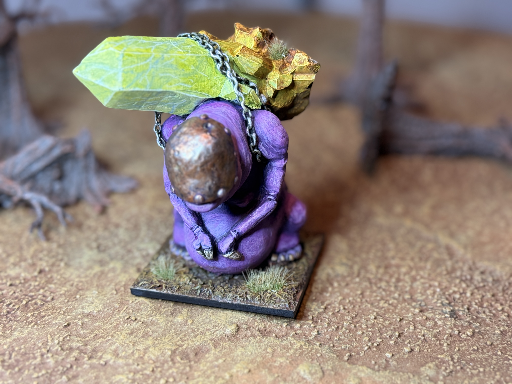
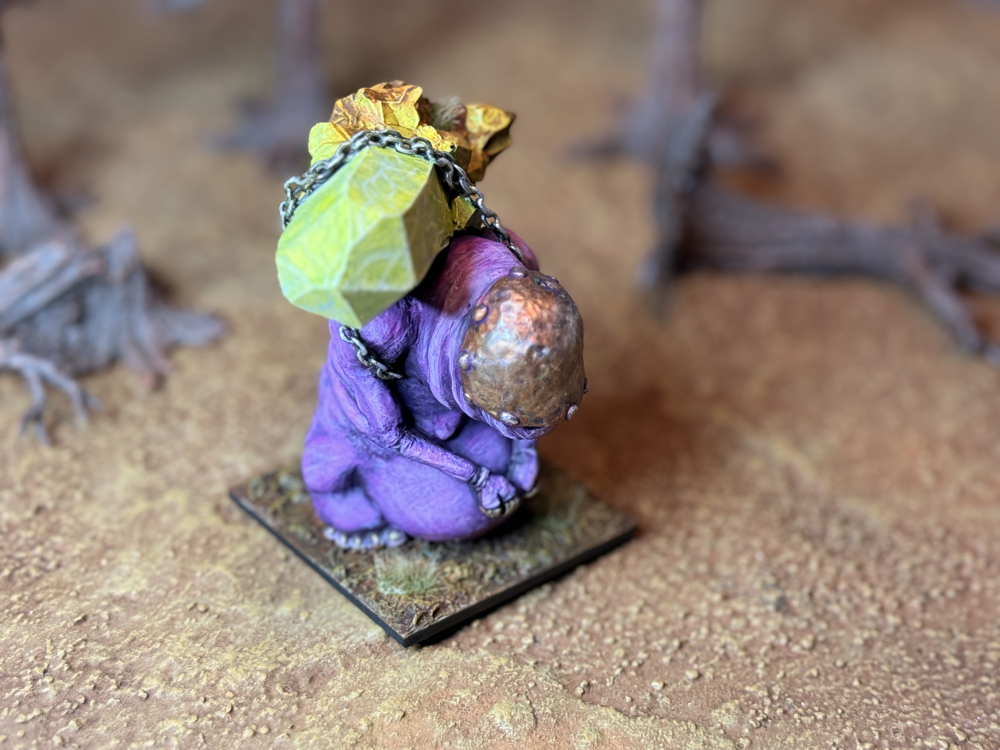
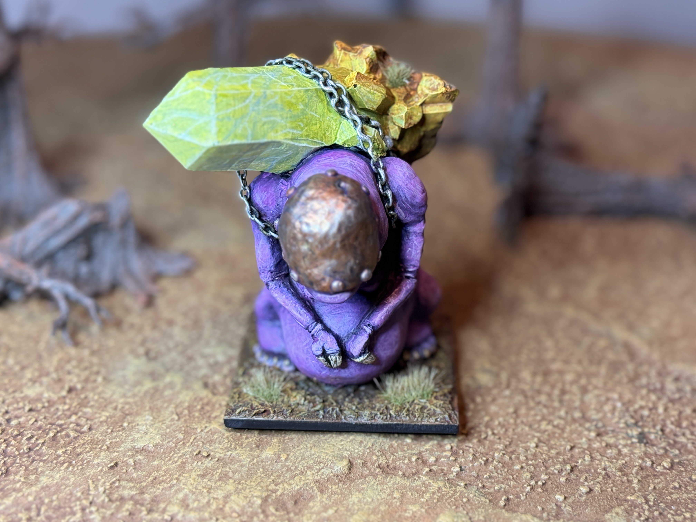
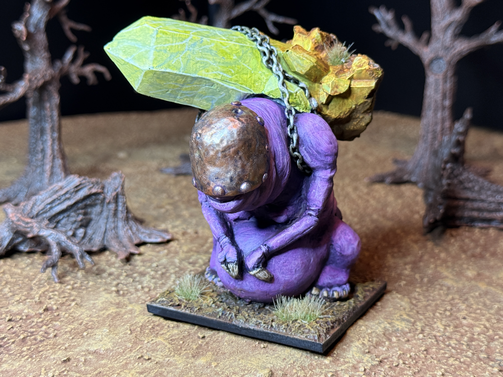
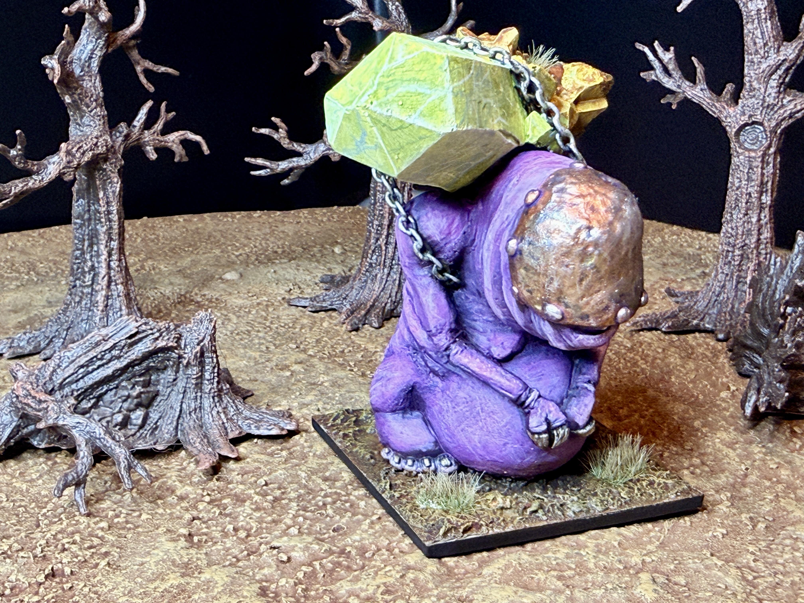
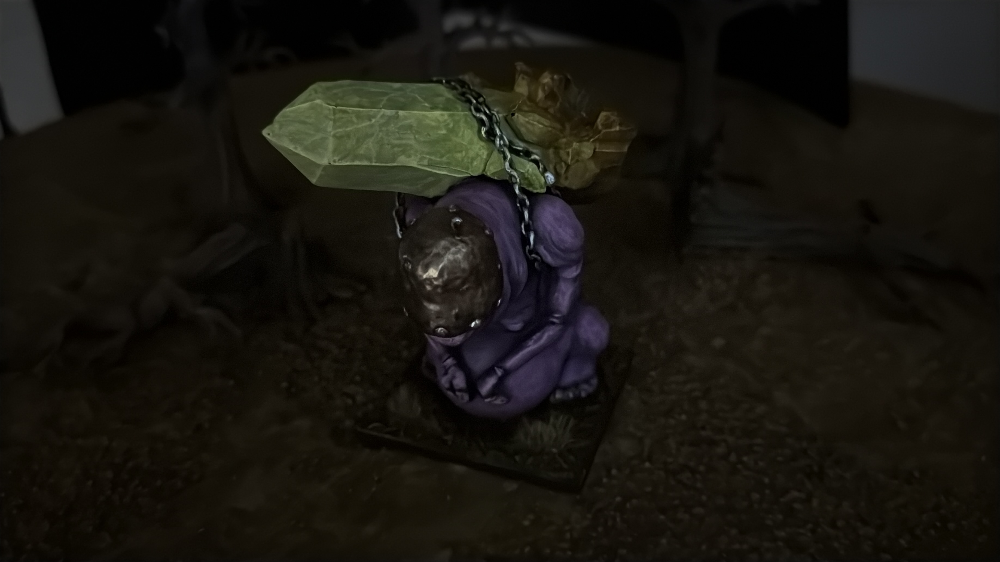
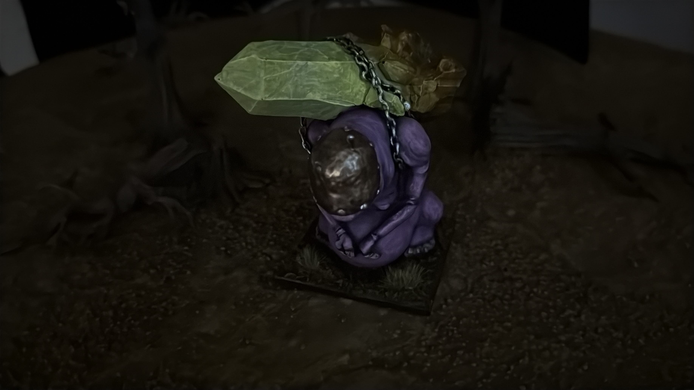

:::gallery

:::

This project was my entry for the **Children of Gomb** competition run by [Electi Studio for Hobgoblin](https://www.electi-studio.com/hobgoblin). It was a wild ride. My first real sculpting project, learning to make molds, and painting techniques I'd never tried before. The whole journey from start to finish is documented in the videos below.

## The Build

<iframe src="https://www.youtube.com/embed/sxnC98FO5T4" frameborder="0" allowfullscreen></iframe>

*Starting My Entry for Children of Gomb — Feb 10, 2026*

<iframe src="https://www.youtube.com/embed/W5Q2RzcnJxk" frameborder="0" allowfullscreen></iframe>

*Starting My First Sculpting Project — Feb 13, 2026*

<iframe src="https://www.youtube.com/embed/-MA7hIaPSy8" frameborder="0" allowfullscreen></iframe>

*More Daemon Prince Progress — Feb 14, 2026*

<iframe src="https://www.youtube.com/embed/-gMaiDR69ok" frameborder="0" allowfullscreen></iframe>

*Sculpting Toes — Feb 15, 2026*

<iframe src="https://www.youtube.com/embed/Muy6fNAUH0E" frameborder="0" allowfullscreen></iframe>

*Making a Mold to Recast and Customize Miniatures — Feb 16, 2026*

<iframe src="https://www.youtube.com/embed/rNEsJTI3-es" frameborder="0" allowfullscreen></iframe>

*Finishing the Daemon Prince and Mail Day — Feb 18, 2026*

<iframe src="https://www.youtube.com/embed/wkSEALqkwME" frameborder="0" allowfullscreen></iframe>

*I Created My First Miniature Thing — Feb 21, 2026*

## The Paint Job

<iframe src="https://www.youtube.com/embed/6DiV4eqqgwA" frameborder="0" allowfullscreen></iframe>

*Painting Creepy Cartoonish Skin — Mar 5, 2026*

<iframe src="https://www.youtube.com/embed/bWV0v1u65es" frameborder="0" allowfullscreen></iframe>

*More Progress on the Children of Gomb Entry — Mar 9, 2026*

<iframe src="https://www.youtube.com/embed/OViRoDqWe4E" frameborder="0" allowfullscreen></iframe>

*Painting Chaosy Green Marble — Mar 11, 2026*

<iframe src="https://www.youtube.com/embed/JGtcVCnOauI" frameborder="0" allowfullscreen></iframe>

*I Finished the Daemon Prince — Mar 12, 2026*
